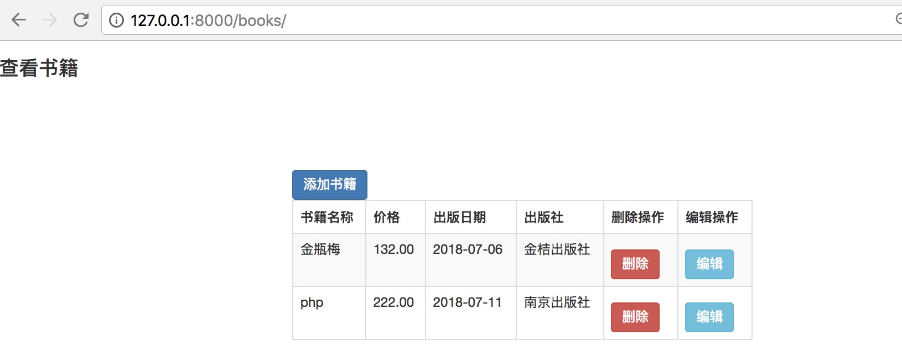

###图书管理系统

实现功能：book单表的增删改查

###图书管理系统代码结构
.   
|____bookms   
| |______init__.py   
| |____settings.py   
| |____urls.py   
| |____wsgi.py   
|____README.md   
|____templates     
| |____books.html   
| |____addbook.html   
| |____changebook.html   
|____manage.py   
|____app01   
| |____migrations   
| | |______init__.py   
| | |______pycache__   
| | | |____0001_initial.cpython-36.pyc   
| | | |______init__.cpython-36.pyc   
| | |____0001_initial.py   
| |____models.py   
| |____init__.py   
| |____apps.py   
| |____admin.py   
| |____tests.py   
| |____views.py   
| |____static   
| | |______init__.py   
| | |____bootstrap-3.3.7   
| | | |____css
| | | | |____bootstrap.min.css   
| | | | |____bootstrap.css   

###显示效果

